# Starter showing configuration driven transformation

## Defaults
* Port: 5500 (--host=0.0.0.0 --port=5500) 
```bash
export CDA_HOST='http://localhost:8080'
export FLASK_APP=app
flask run -h 0.0.0.0 -p 5500
```

## Things to know
* Dynamic Routes in Camel:dynamicRoute: 
* Camel calls the XSL endpoint to get XSLT documents: /api/xsl?name={FHIR Resource}

## Usage
### Step 1: Message Types - Nothing works wihtout these 
* Message Types admin screen shows defined message types
* There are FHIR resources and links each resource to an end-point in Camel
* They are editable
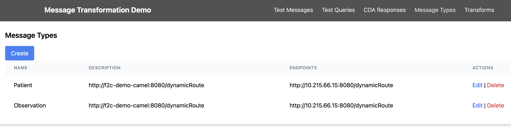

* Creating a message type
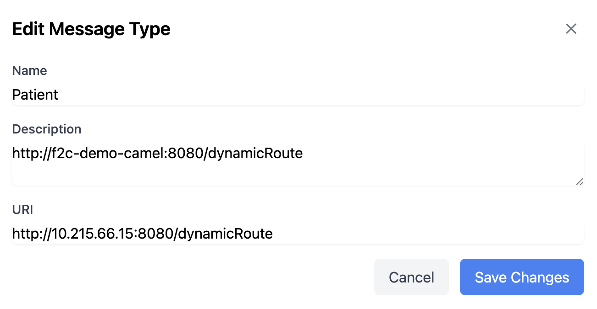

### Step 2: Create message Transforms
* Message transforms map from FHIR to CDA or CDA to FHIR
* Transforms are XSL documents
* Camel looks them up by FHIR Resource type defined in Message Type
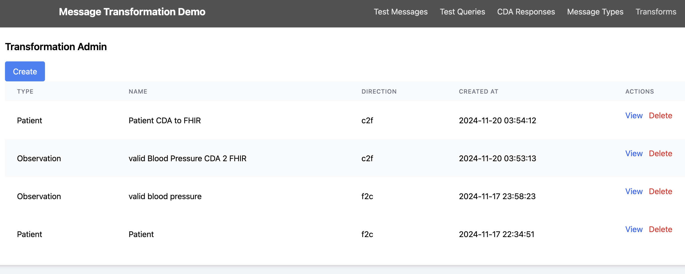

* Creating transform
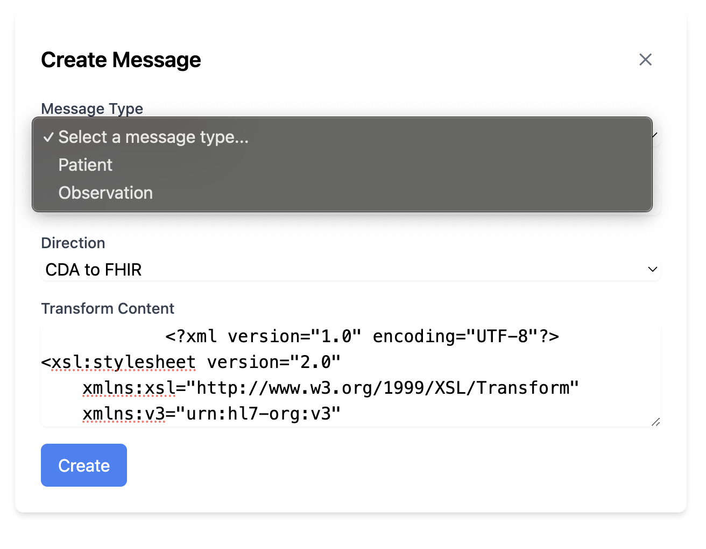

### Step 3: Create Test Messages
* Test messages are FHIR JSON messages
* Create one or more of these from the admin screen
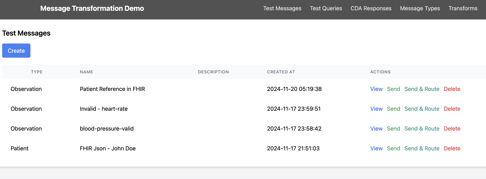
* They are linked to FHIR Resource Types
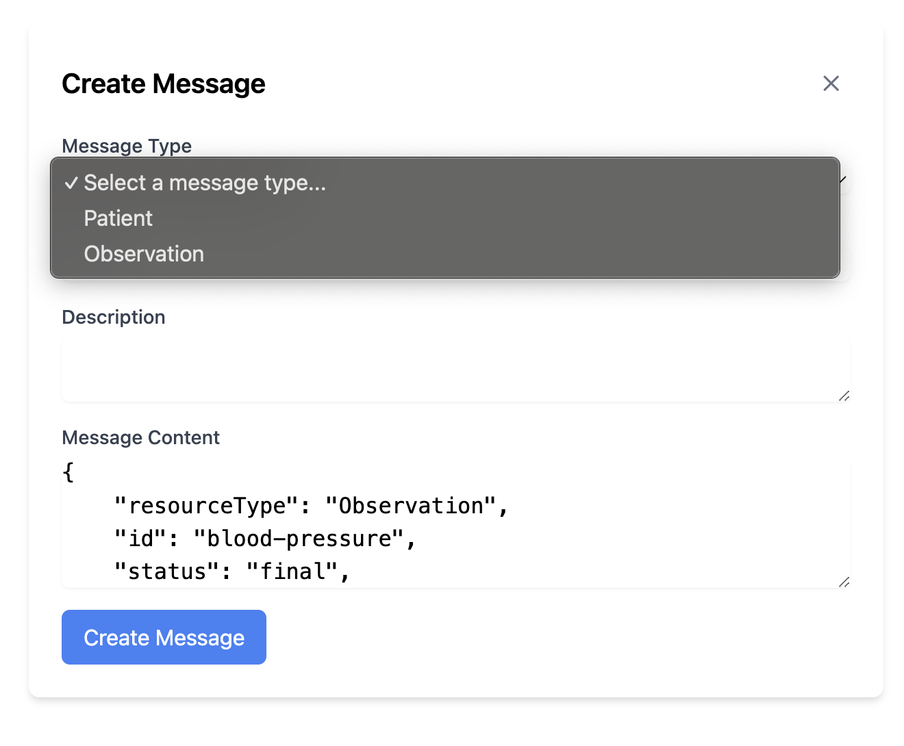

### Step 4: Run Messages
* From Test Messages Screen **Send** or **Send & Route** test messagaes
* **Send** will send it a mocked CDA endpoint and store the result
* **Send & Route** will send it to a FHIR resource server (you need to run one)

* You can view results of the mocked CDA resource in **CDA Responses**
* Once you have messages sent then you can use the **Test Queries** to retrieve resources
* Output will show a message flow if everything works as expected you will see green circles
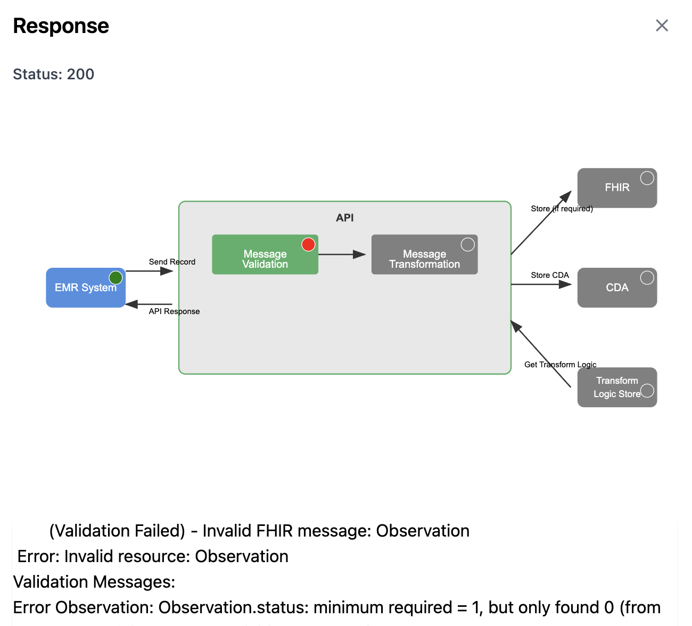
* If you see a red circle in the **EMR** box - then check your endpoints under **Message Types**
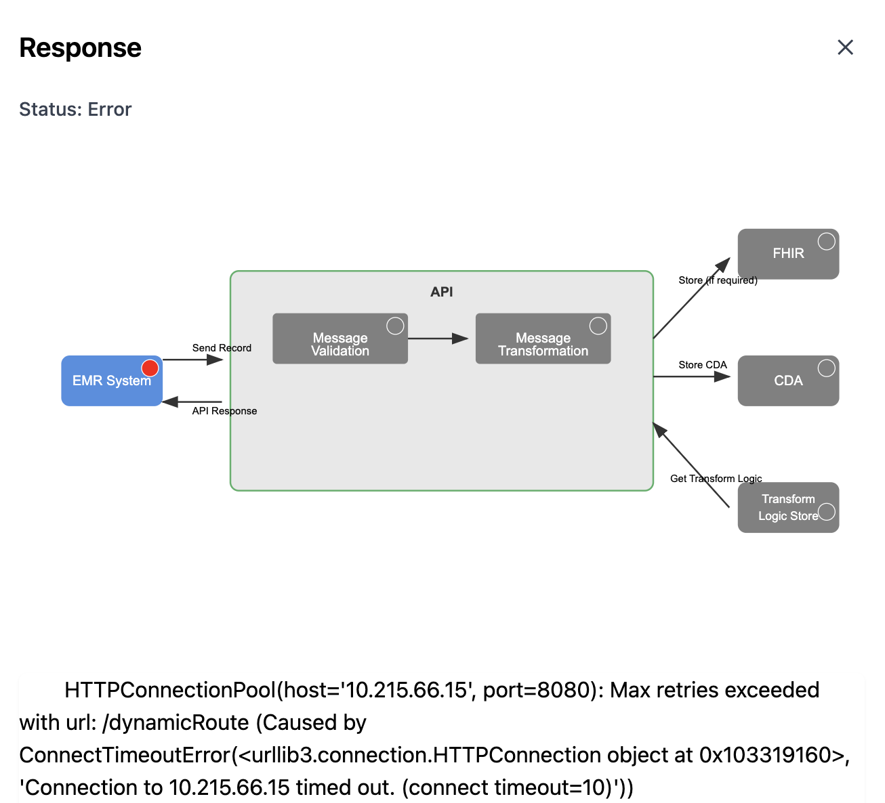

### Step 5: Look at what is in Mock CDA
* **CDA Responses** shows mock CDA messages
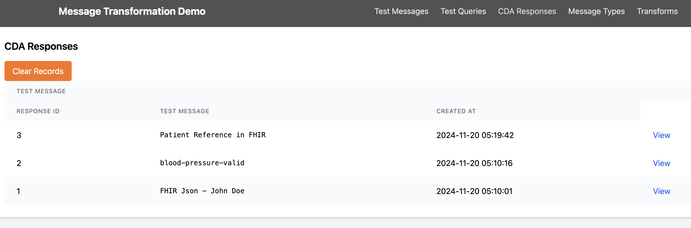

### Step 6: Retrieve Resources - testing CDA to FHIR and FHIR passthrough
* Querying for CDA will return FHIR in XML based on what is in the Mock CDA service
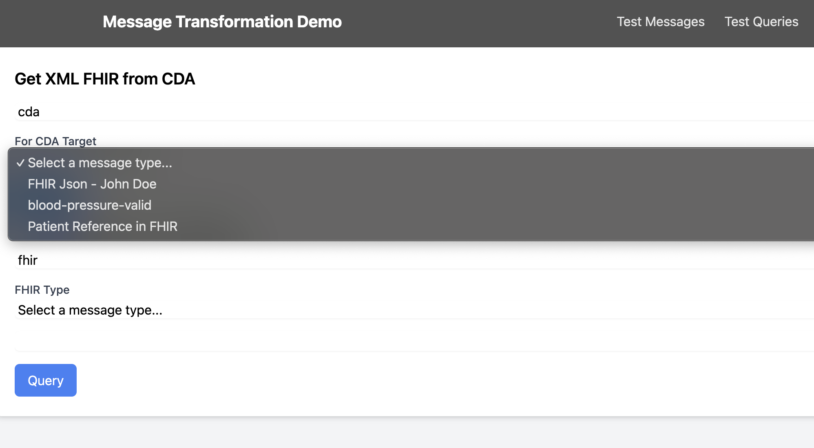
* Querying FHIR requires you to specify the resource and resource ID
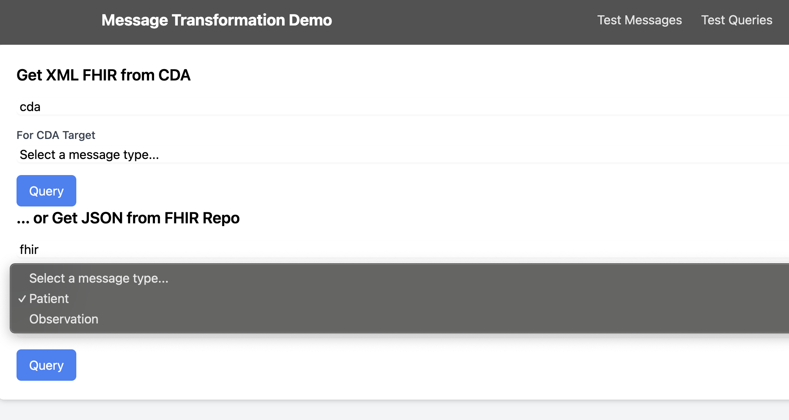

## Seom Testing endpoints from CLI
* Getting message type transform
```bash
curl "localhost:5500/api/xsl?name=Patient"
```

## Full container setup with networking after building everything
* Depends on: https://github.com/yohanswanepoel/camel-fhir
* Depends on: HAPI FHIR JPA
* change your message type endpoint to: http://f2c-demo-camel:8080/dynamicRoute

Access UI: http://127.0.0.1:5500/
```bash
podman network create demonet
podman run --rm --name f2c-demo-ui --network -e CAMEL_HOST="http://localhost:8080" demonet -p 5500:5000 localhost/f2c-demo-ui
```

Did you build the camel route container as per the instructions in: https://github.com/yohanswanepoel/camel-fhir ?
```bash
podman run --rm --name f2c-demo-camel --network demonet -p 8080:8080 -e env_xslhost="http://f2c-demo-ui:5000/api/xsl?name=" -e env_fhirhost="http://fhirhost:8080/fhir" -e env_cdahost="http://10.215.66.15:5500/cda_system" f2c-demo-camel
```

If you want the FHIR host: http://localhost:8090/
```bash
podman run --rm --name fhirhost --network demonet -p 8090:8080  hapiproject/hapi:latest
```

Cleaning it all up
```bash
podman stop f2c-demo-ui
podman stop f2c-demo-camel
podman stop fhirhost
podman network rm demonet
```

## containers
Building for testing on mac
```bash
podman build . -t f2c-demo-ui
podman run --rm --name f2c-demo-ui -p 5500:5000 localhost/f2c-demo-ui
```

Building to push to x86 repo
```bash
podman build . -t f2c-demo-ui --platform linux/amd64
```

